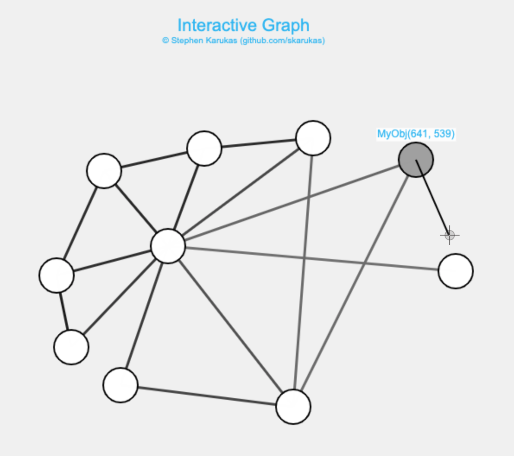

# graph-gui
An (in progress) interactive graph interface using the HTML canvas element. 

It displays data stored in edges and vertices of an undirected graph, serving as a simple front end for a variety of graph-based representations. Two demos included are the following:
- The [first](https://skarukas.github.io/graph-gui/index.html) simply allows direct editing of edge and vertex labels (no back end data). Code: [`stringDemo.js`](./stringDemo.js).
- The [second](https://skarukas.github.io/graph-gui/demo.html) displays 2-D points and their Euclidian distances. Code: [`demo.js`](./demo.js).

#### GUI commands:
- Dragging vertices changes their position.
- Command/Ctrl-dragging connects two vertices. 
- Holding shift deletes edges or vertices. 
- Right-clicking in an empty space creates a new vertex.
- Right-clicking over a vertex or edge edits its data.

The framework emits events when the user attempts to add, remove, or edit vertices and edges, and when they move vertices. These events can be handled and approved by programmer-defined methods located in `Graph.event`. More documentation about creating custom handlers coming soon.

Only tested on Mac (Safari/Chrome) at the moment.
